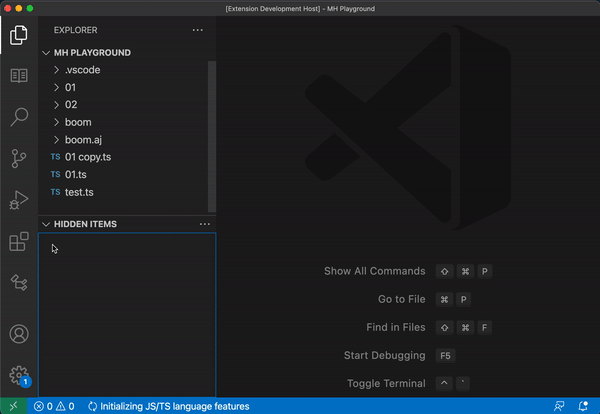
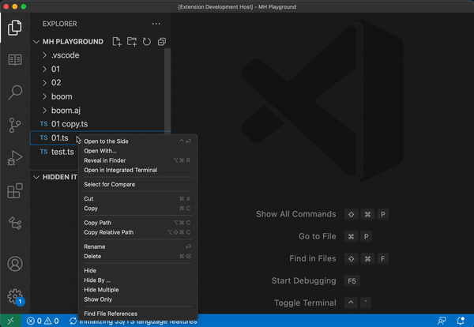
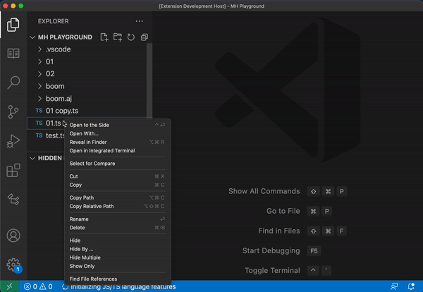

# Make Hidden

A VS Code plugin that provides more control over your excluded items in your "Project Directory". Perform actions such as show, hide, hide multiple on file and folders from the context menu. You can also keep track of these items their own window view pane. Create workspaces to quickly switch between bulk excluded items.

### Features

#### Added context menu actions

- **Hide** - Simply hide/exclude a file and or folder from the project directory.
- **Hide Multiple** - Quickly bulk select multiple items within the projects directory to hide.
- **Hide By** - Perform advanced hide options on a give file **_Name_** or **_extension_**.
- **Show only** - Hide all items within the current directory, except selected.

#### Other

- **Hidden Items View Pane** - Shows all hidden/excluded files and folder, these can also be added back into the current directory by selecting one.
- **Workspaces** - Save your hidden items into a workspace so you can quickly apply that list at your will.

# Usage

### Hide

Right click on a file or folder in the projects directory. Then select **`Hide`** to exclude that item rendering it invisible.

### Hide Multiple

Selecting **`Hide Multiple`** will bring up and multi selection window where you are able to choose the items you wish to hide.

### Hide By

Right click on a file or folder in the projects directory. Then select **`Hide By`** and you will be presented with the following options:

**First Options**

1. **By name**: Hide all items that match the selected items name.
2. **By extension**: To only target & exclude items with the corresponding extension.

**Second Options**

1. **From root**: Hide all files/folders from the root.
2. **From current directory**: Hide all from the directory the ite is in.
3. **From current & child directories**: Hide all matching items from the directory the item is in and all child.
4. **Child directories only**: Will hide all files/folders from the root.

### Show Only

Will keep the selected item(file/folder) and hide all other items in the same directory.

## View Pane Hidden Items

The Hidden Items view pane enables you to see regex codes that are applied to the current directory that are hiding items. From here, you can also create, load and delete workspaces.

## License

[MIT](LICENSE.md)
