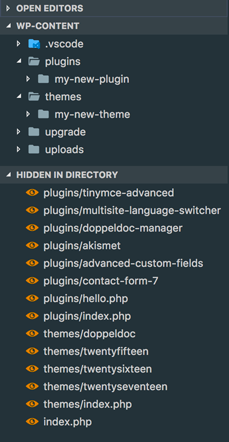
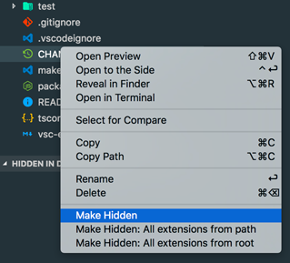

# VS Code Make Hidden

Make Hidden enhances the built-in functionality of "files.exclude". It provides an explorer interface to allow for a quick and easy overview of the hidden/exclude files from the projects directory. 

Context menus options are also added to perform multiply hidden/exclude options quickly.

## Known Issues

## Release Notes

## License

[MIT](LICENSE.md)