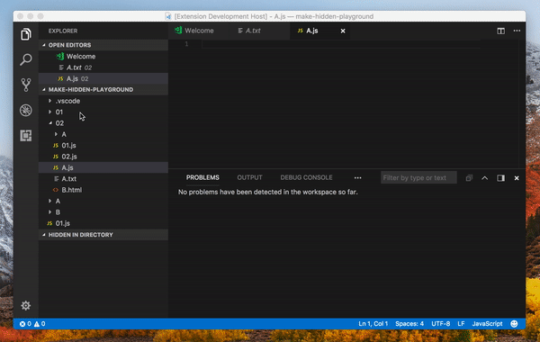

# Make Hidden
Make Hidden provides you with the simple way to hide/show files & folders within your project's directory.

#### Feature List
1. **Hide**: will hide the current file/folder from the projects directory and add it into the "Hidden in directory" View Pane.
2. **Super hide**: hide's multiple items within project's directory by matching ***Name*** or ***Extension***.
3. **Show only**: hide's all except current item.
4. **View Pane**: Clearly outlines all hidden files in project's directory.

## Context Menu
Effortlessly hide/show files & folders from context menu by right-clicking on a file/folder and you will be presented with 3 new options **Hide**, **Super Hide** and **Show Only**.

### Hide
Will hide the current file/folder from the projects directory and add it into the "Hidden in directory" View Pane.

### Super Hide
Is designed to hide multiple files/folders at once. This option you will prompt you with the following choices:

**First choices**:
1. ***Hide against matching name's***: will hide any files/folders with the same name.
2. ***Hide against matching extension's***: will hide any files with the same extension as the same item selected.

**Second choices**:
1. ***From root***: Hide all files/folders from the root.
2. ***Current directory***: Hide all from the directory the item is in.
3. ***Current & Child directories***: Hide all matching items from the directory the item is in and all child.
4. ***Child directories only***: Will hide all files/folders from the root.

### Show Only
Will keep the selected file/folder and hide all other items in the same directory.

#### View Pane "Hidden in directory"
The "Hidden in directory" view pane will show all current items listed in the "files.exclude".

## License
[MIT](LICENSE.md)