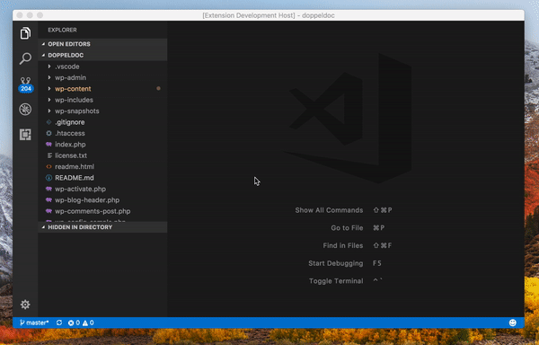
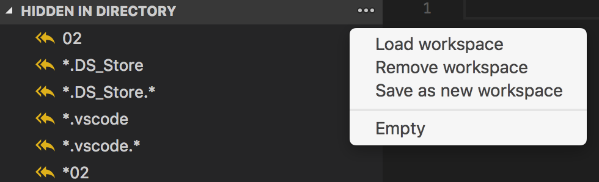

# Make Hidden
A VS Code plugin that provides more control over your excluded items in your "Project Directory". Perform show/hide actions on file/folders right from the context menu and keep track of these in their own window view pane. Save bulk excluded items in workspaces to quickly toggle between them.

### Features
#### Context Menu
-  **Hide**: Design to simply hide/exclude a file and or folder from the project directory.
-  **Hide Many**: Hide multiple items that match a chosen ***Name*** and or ***File extension***. The directory level can also be configured from where the exclusion happens. Wherever that be at the root level or at the level of which the item was selected at or below.
-  **Show only**: Hide all items within the current directory, except selected item.
-  **Undo Last**: Op's, rewind to last given excluded items state.

#### Other
-  **View Pane**: Outlines all hidden/excluded files and folder. Items can also add back into the directory by selecting one, making it quick and easy to show/hide.
-  **Workspaces**: Store excluded items and switch between saved workspaces.

## Usage
### Hide

### Hide Many
Firstly, right click on a file or folder in the projects directory. Then select **Hide Many** and you will be presented with the following options:

**Option One**
1. **By name**: Hide all items with a matching selected item name.
2. **By extension**: To only target item with the corresponding extension.

**Option Two**
1. **From root**: Hide all files/folders from the root.
2. **Current directory**: Hide all from the directory the item is in.
3. **Current & Child directories**: Hide all matching items from the directory the item is in and all child.
4. ***Child directories only***: Will hide all files/folders from the root.

### Show Only
Will keep the selected file/folder and hide all other items in the same directory.

#### View Pane "Hidden in directory"
The "Hidden in directory" view pane displays all hidden items within the current directory. From here you can also create, save and remove personal workspaces.

## License
[MIT](LICENSE.md)