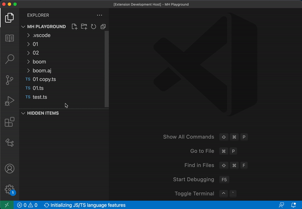
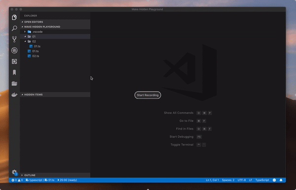
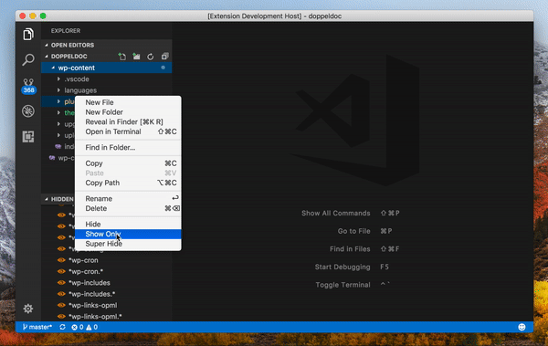
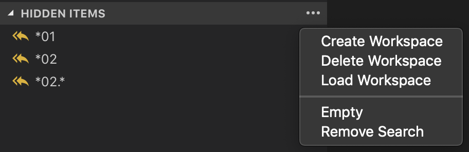

# Make Hidden
A VS Code plugin that provides more control over your excluded items in your "Project Directory". Perform show/hide actions on file/folders right from the context menu and keep track of these in their own window view pane. Save bulk excluded items in workspaces to quickly toggle between them.

### Features
#### Added context menu actions
-  **Hide**: Design to simply hide/exclude a file and or folder from the project directory.
-  **Hide Many**: Hide multiple items that match a chosen ***Name*** and or ***File extension***. The directory level can also be configured from where the exclusion happens. Wherever that be at the root level or at the level of which the item was selected at or below.
-  **Show only**: Hide all items within the current directory, except selected.
-  **Undo Last**: Op's, rewind to last given excluded items state.

#### Other
-  **Hidden Items View Pane**: Shows all hidden/excluded files and folder, these can also be added back into the current directory by selecting one.
-  **Workspaces**: Workspaces allow you to save excluded items presets so that they can be applied/loaded again easily.

# Usage
### Hide
Right click on a file or folder in the projects directory. Then select **`Hide`** to exclude that item rendering it invisible.

### Hide Many
Right click on a file or folder in the projects directory. Then select **`Hide Many`** and you will be presented with the following options:

**First Options**
1. **By name**: Hide all items that match the selected items name.
2. **By extension**: To only target & exclude items with the corresponding extension.

**Second Options**
1. **From root**: Hide all files/folders from the root.
2. **From current directory**: Hide all from the directory the ite is in.
3. **From current & child directories**: Hide all matching items from the directory the item is in and all child.
4. **Child directories only**: Will hide all files/folders from the root.

### Show Only
Will keep the selected item(file/folder) and hide all other items in the same directory.

## View Pane Hidden Items
The Hidden Items view pane enables you to see regex codes that are applied to the current directory that are hiding items. From here, you can also create, load and delete workspaces.

## License
[MIT](LICENSE.md)